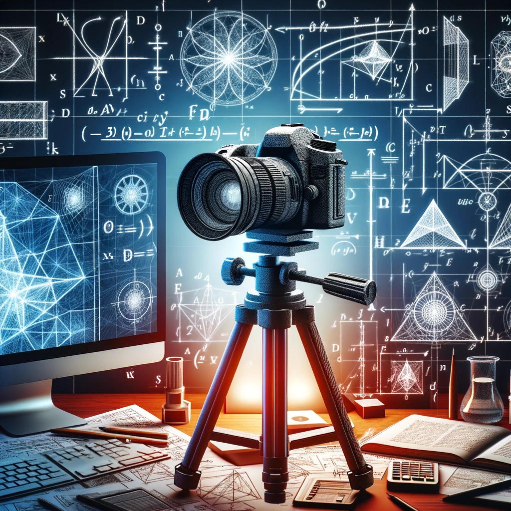
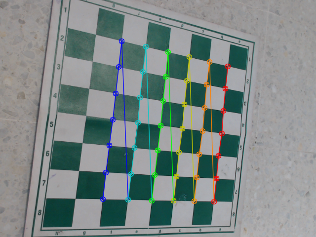
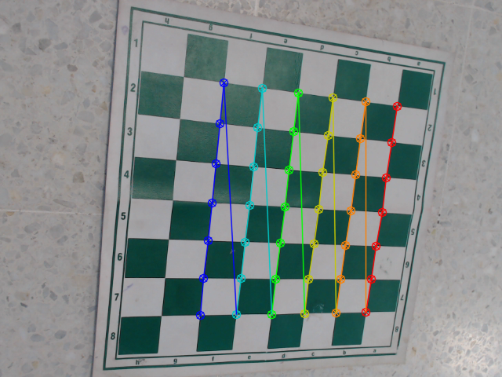
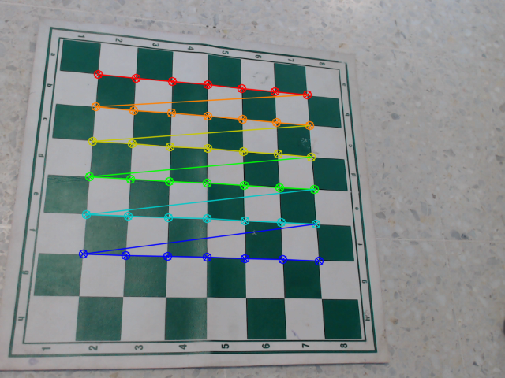

**#CAMERA CALIBRATION**

Este documento detalla el proceso de calibración de la cámara haciendo uso de las bibliotecas OpenCV. Dentro del archivo **calibration.py** se encuentran los parámetros cruciales para esta tarea. Por ejemplo, se ha configurado un límite máximo de 30 iteraciones antes de concluir la prueba, lo cual resulta fundamental para potenciar la precisión de la calibración de la cámara. Además, en este README, se establece un valor de epsilon igual a 0.001 como parte integral de la documentación en el contexto de este repositorio en GitHub.

La calibración de cámara es esencial para obtener los parámetros intrínsecos y de distorsión de la cámara. Esto incluye la distancia focal, el punto principal y los coeficientes de distorsión radial y tangencial.

Los parámetros intrínsecos definen cómo la cámara proyecta el mundo 3D en una imagen 2D.
Los coeficientes de distorsión modelan imperfecciones en la lente de la cámara.
La corrección de distorsión resultante garantiza mediciones precisas y una representación fiel de los objetos en la imagen. En aplicaciones de visión por computador es muy necesaria la calibración, ayuda a renderizar las imágenes.

**Parámetros de la Cámara**

1. **Matriz de la Cámara (mtx):**
   - La matriz de la cámara (mtx) es una matriz 3x3 que define la relación entre las coordenadas 3D del mundo real y las coordenadas 2D de la imagen capturada por la cámaraa.
   - Sus elementos son:
     - fx: Factor de escala en la dirección x.
     - fy: Factor de escala en la dirección y.
     - cx: Coordenada del punto principal en la dirección x.
     - cy: Coordenada del punto principal en la dirección y.
   - Esta matriz permite mapear puntos en el espacio 3D a puntos en el plano de la imagen.

2. **Coeficientes de Distorsión (dist):**
   - Los coeficientes de distorsión (dist) son parámetros que modelan las imperfecciones en la lente de la cámara.
   - Incluyen:
     - k1, k2, k3: Coeficientes radiales que modelan la distorsión radial.
     - p1, p2: Coeficientes tangenciales que modelan la distorsión tangencial.
   - Estos coeficientes se utilizan para corregir la distorsión en las imágenes capturadas, lo que permite una representación más precisa de los objetos en la imagen.

3. **Parámetros Intrínsecos:**
   - Los parámetros intrínsecos de la cámara son elementos individuales de la matriz de la cámara (mtx) y los coeficientes de distorsión (dist).
   - fx y fy: Representan la distancia focal en las direcciones x e y, respectivamente.
   - cx y cy: Son las coordenadas del punto principal en las direcciones x e y, respectivamente.
   - k1, k2, k3: Modelan la distorsión radial.
   - p1 y p2: Modelan la distorsión tangencial.

4. **Imágenes de muestra**

Estas las entrega el script llamado **calibration.py**

  
Ver Imágenes

  

    
    
    
  

